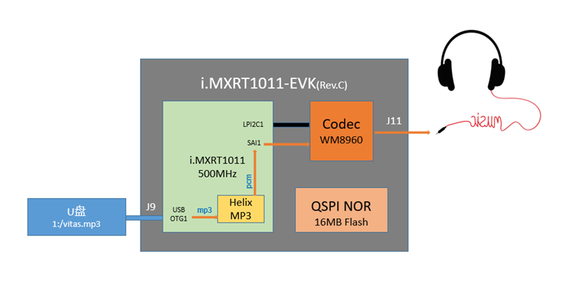
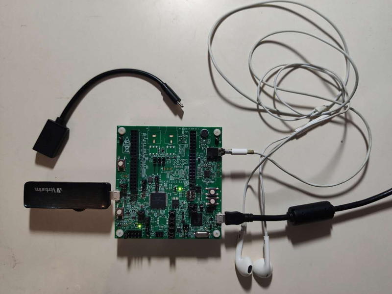

# RT-Mp3Player
An MP3 player based on i.MXRT1010+emWin+USB+FatFS+Helix MP3 | 一款基于i.MXRT的MP3播放器

i.MXRT1011是恩智浦i.MXRT四位数系列的入门型号，虽然是入门级，可也是500MHz主频的大杀器。

为了让大家见识到i.MXRT1011的能量，特给大家分享一个基于i.MXRT1011-EVK开发板的MP3播放器设计，mp3源文件从U盘获取，使用Helix MP3库进行软解码，最后将解码出的pcm数据通过板载Codec（WM8960）连耳机进行播放。

功能模块简图：



这个设计目前还处于初级阶段，但已经实现了最核心的mp3文件解码与播放。设计主要参考了SDK包里的两个例程：通过USB读取U盘中的音频源文件（usb_host_msd_fatfs），使用I2C对Codec进行设置后使用SAI和DMA进行数据的传输（sai）.

```text
SDK\boards\evkmimxrt1010\usb_examples\usb_host_msd_fatfs\bm
SDK\boards\evkmimxrt1010\demo_apps\sai
```

此外，核心mp3解码功能是使用了正点原子移植好的Helix MP3解码库。因为一些历史原因，我们在Helix Community官网下载不到源码了，这里感谢原子哥的开源。

全部硬件清单：

```text
1. MIMXRT1010-EVK (Rev.C)
2. U盘 (Micro-USB接口)
3. 耳机（3.5mm接口），或音箱
4. USB线（连主机供电）
```

实物连接图：



代码是开源的，会持续添加功能（考虑加入Arduino接口的触摸屏，实现GUI），欢迎感兴趣的小伙伴加入一起开发！

> * 代码仓库： https://github.com/JayHeng/RT-Mp3Player

